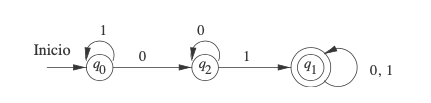

##  https://github.com/Carlos-ZRM/TeoriaComputacional
## carloszrm90@gmail.com

# Definición formal de un autómata finito determinista
- Q: conjunto finito de estados
-  Σ: Un conjunto finito de símbolos de entrada 
- δ(q,a): Función de transición
- q0: Estado inicial del autómata 
- F: Conjunto de estados de aceptación 
## Autómata que acepta las cadenas que contienen 01

### Establecer los casos generales

#### Aceptación 
- la palabra es "01"
- la palabra empieza o termina con "01": "01XXX" , "XXX01"
- la palabra empieza con "0" y "1" consecutivos : "0001XXX", "1101XXX" 

- la pal
#### Rechazo
- la palabra sólo contiene "000..." y "111.."

### Generar los elementos del autómata

- Q: 
    - q0 : Estado inicial del autómata
    - q2 : El aútomata leyó "0"
    - q1 : El autómata leyó "1"
    
-  Σ: "0", "1"
- q0: Estado inicial
- F: {q1}
- δ(q,a): Función de transición
#### Tabla de transiciones 

||0|1|
|--|--|--|
| -> q0|q2|q0|
|* q1|q1|q1|
|q2|q2|q1|

# Simulación de un autómata finito determinista

